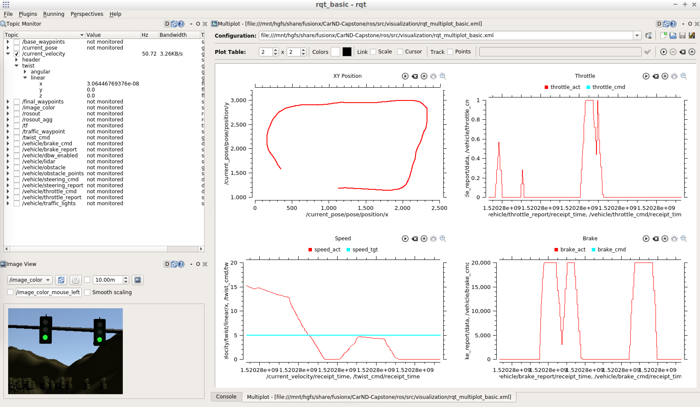
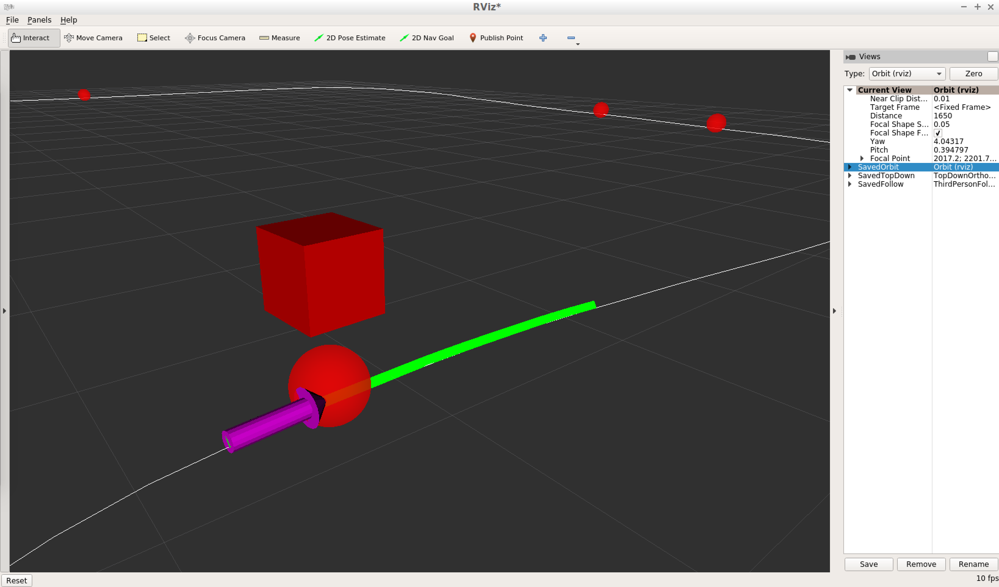

# Team FusionX - CarND Capstone Project

Udacity Self-Driving Car Nanodegree


### Team Members

### Overview

### Visualization Tools

This project includes some visualization tools for monitoring data while running the simulation using **RQT** and **RViz**.  The related layout files are stored in the **/ros/src/visualization/** folder.

#### RQT (multipurpose dashboard)
* **Setup:**
    For plotting data in RQT, the [rqt_multiplot_plugin](https://github.com/ethz-asl/rqt_multiplot_plugin) is used instead of the base [rqt_plot](https://github.com/ros-visualization/rqt_plot) for better plotting features and performance.  To install the multiplot plugin, run:

    ```
    sudo apt-get update
    sudo apt-get install ros-kinetic-rqt-multiplot
    rqt --force-discover
    ```

    If successful, the multiplot plugin should be available in the RQT menu *Plugins > Visualization > Multiplot*.

    After installing the multiplot plugin, a basic RQT layout can be imported by going to the RQT menu *Perspectives > Import* and select the **rqt_basic.perspective** file.

* **Operation:**
    To use RQT to monitor data, after roslaunching the styx program and connecting to the simulator, start another shell in the /ros/ folder and run:

    ```
    source devel/setup.bash
    rqt
    ```

    Switch to the Basic perspective if not already loaded by default, and confirm communication by enabling one of the topics in the Topic Monitor.
    To start the plots, click the **play all** button at the top right of the multiplot pane.

    [](./imgs/screen_rqt_basic.png)

#### RViz (3D scene view)

* **Setup:**
    To visualize the car's position relative to the waypoints and traffic lights in an RViz 3D scene, a **visualization node** is used to publish a **/visualization_marker_array** topic to populate the objects and a **/visualization_basewp_path** topic to populate a path line.

    The visualization node publishes when the parameter *vis_enabled == True*, set by default in the **styx.launch** file.  When using **site.launch** in the actual vehicle, the visualization node is not launched to reduce bandwidth.

    RViz is included in the ROS desktop install, so no additional setup is needed.

* **Operation:**
    RViz can be run either as a stand-alone program or as a plug-in within RQT, but there is a bug in the RQT plug-in that causes a crash when rendering the base waypoint path so **RViz should be run as stand-alone**.  To use it as a stand-alone program, after roslaunching the styx program and connecting to the simulator, start another shell in the /ros/ folder and run:

    ```
    source devel/setup.bash
    rviz
    ```

    A basic RViz layout can by loaded by going to the RViz menu *File > Open Config* and select the **rviz_basic.rviz** file.  In the RViz layout, the view can be switched between saved view settings in the *Views* list on the right side.  The mouse wheel and left/middle buttons can be used to move/zoom the camera.

    [](./imgs/screen_rviz_basic.png)

---

### *Original instructions from Udacity base repo:*

This is the project repo for the final project of the Udacity Self-Driving Car Nanodegree: Programming a Real Self-Driving Car. For more information about the project, see the project introduction [here](https://classroom.udacity.com/nanodegrees/nd013/parts/6047fe34-d93c-4f50-8336-b70ef10cb4b2/modules/e1a23b06-329a-4684-a717-ad476f0d8dff/lessons/462c933d-9f24-42d3-8bdc-a08a5fc866e4/concepts/5ab4b122-83e6-436d-850f-9f4d26627fd9).

Please use **one** of the two installation options, either native **or** docker installation.

### Native Installation

* Be sure that your workstation is running Ubuntu 16.04 Xenial Xerus or Ubuntu 14.04 Trusty Tahir. [Ubuntu downloads can be found here](https://www.ubuntu.com/download/desktop).
* If using a Virtual Machine to install Ubuntu, use the following configuration as minimum:
  * 2 CPU
  * 2 GB system memory
  * 25 GB of free hard drive space

  The Udacity provided virtual machine has ROS and Dataspeed DBW already installed, so you can skip the next two steps if you are using this.

* Follow these instructions to install ROS
  * [ROS Kinetic](http://wiki.ros.org/kinetic/Installation/Ubuntu) if you have Ubuntu 16.04.
  * [ROS Indigo](http://wiki.ros.org/indigo/Installation/Ubuntu) if you have Ubuntu 14.04.
* [Dataspeed DBW](https://bitbucket.org/DataspeedInc/dbw_mkz_ros)
  * Use this option to install the SDK on a workstation that already has ROS installed: [One Line SDK Install (binary)](https://bitbucket.org/DataspeedInc/dbw_mkz_ros/src/81e63fcc335d7b64139d7482017d6a97b405e250/ROS_SETUP.md?fileviewer=file-view-default)
* Download the [Udacity Simulator](https://github.com/udacity/CarND-Capstone/releases).

### Docker Installation
[Install Docker](https://docs.docker.com/engine/installation/)

Build the docker container
```bash
docker build . -t capstone
```

Run the docker file
```bash
docker run -p 4567:4567 -v $PWD:/capstone -v /tmp/log:/root/.ros/ --rm -it capstone
```

### Port Forwarding
To set up port forwarding, please refer to the [instructions from term 2](https://classroom.udacity.com/nanodegrees/nd013/parts/40f38239-66b6-46ec-ae68-03afd8a601c8/modules/0949fca6-b379-42af-a919-ee50aa304e6a/lessons/f758c44c-5e40-4e01-93b5-1a82aa4e044f/concepts/16cf4a78-4fc7-49e1-8621-3450ca938b77)

### Usage

1. Clone the project repository
```bash
git clone https://github.com/udacity/CarND-Capstone.git
```

2. Install python dependencies
```bash
cd CarND-Capstone
pip install -r requirements.txt
```
3. Make and run styx
```bash
cd ros
catkin_make
source devel/setup.sh
roslaunch launch/styx.launch
```
4. Run the simulator

### Real world testing
1. Download [training bag](https://s3-us-west-1.amazonaws.com/udacity-selfdrivingcar/traffic_light_bag_file.zip) that was recorded on the Udacity self-driving car.
2. Unzip the file
```bash
unzip traffic_light_bag_file.zip
```
3. Play the bag file
```bash
rosbag play -l traffic_light_bag_file/traffic_light_training.bag
```
4. Launch your project in site mode
```bash
cd CarND-Capstone/ros
roslaunch launch/site.launch
```
5. Confirm that traffic light detection works on real life images
