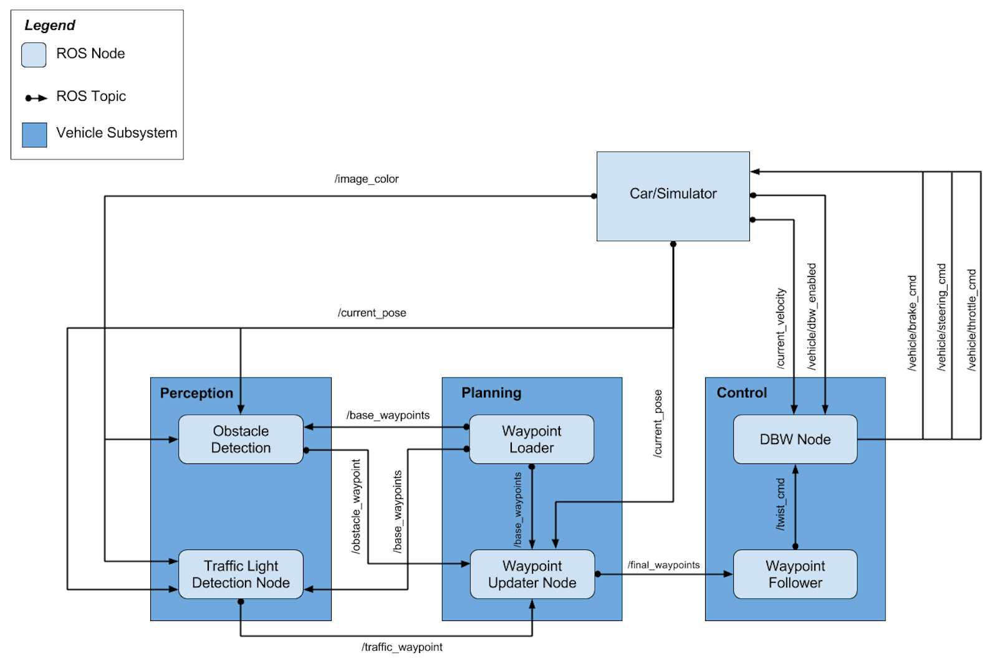
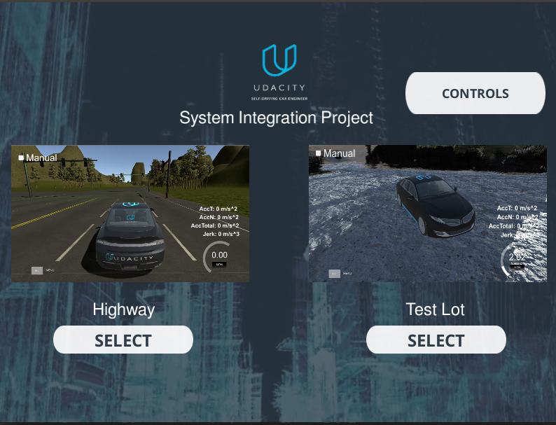

# Capstone Project System Integrations
[](http://www.udacity.com/drive)

This is the final system integration project for Udacity Self-Driving Car Nanodegree. It is a group project that our team, CondorHero, has worked together to integrate perception, planning, and control to drive a car in simulation as well as on Carla (real car).

## Team Members

| Name | Github | Udacity Account Email |
|:----|:----|:----|
|Yangchun Luo|[yangchunluo](https://github.com/yangchunluo)|timycluo@gmail.com|
|Ekalak Rengwanidchakul|[anonymint](https://github.com/anonymint)|mint.com@gmail.com|
|Chris Cheung|[chriskcheung](https://github.com/chriskcheung)|chris.kun.cheung@gmail.com|
|Alex Gu|[alexgu66](https://github.com/alexgu66)|xiaoganggu@hotmail.com|

## Overview

This is the system architecture diagram showing the ROS nodes and topics used in the project.



There are three mains part of the project:

### Perception 
This part contains a traffic light detection node `tl_detector` module which subscribes `/base_waypoints`, `/image_color` and `/current_pose` topics and publishes locations to stop for traffic lights `/traffic_waypoint` (if any) 

This module is like human eyes when we see a traffic light. We will process the traffic light in our brain but for a machine, we use deep learning to classify the image.

### Planning

This module contains the `waypoint_updater` module which is to update the target velocity property based on traffic light data it subscribes from `/traffic_waypoint` as well as `/current_pose` and `/base_waypoints`.

This module receives several data from different topics and calculate the list of waypoints ahead of the car along with target velocities to `/final_waypoints` topic

### Control 

This module is in Carla (name of the real car) equipped with drive-by-wire (dbw) system or simply say that it receives electronic signal to control the physical car throttle, brake, and steering. Basically, this module's responsible for controlling the car to move.

From planning module data published to various topics and it publishes the signal to the car.

## System setup

Infrastructure system can be installed naively on Ubuntu or through docker. Please refer to the original [README document](https://github.com/udacity/CarND-Capstone/blob/master/README.md) for instructions.

Download the latest [simulator](https://github.com/udacity/CarND-Capstone/releases).

Install python dependencies:
```bash
cd PROJECT_DIRECTORY
pip install -r requirements.txt
```
## Usage

```bash
cd PROJECT_DIRECTORY/ros
catkin_make
source devel/setup.sh
```

Launch the simulator:


### Highway track

```bash
roslaunch launch/styx-highway.launch
```
And select the Highway track. Uncheck "Manual" and check "Camera". You should see the car following the green waypoints. The car will stop at red light and move at green light.


### Parking lot

```bash
roslaunch launch/styx-parking.launch
```
And select the Test Lot track. Uncheck "Manual". You should see the car following the green waypoints. 


## Testing on real data

Download [training bag](https://s3-us-west-1.amazonaws.com/udacity-selfdrivingcar/traffic_light_bag_file.zip) that was recorded on the Udacity self-driving car.
Unzip the file
```bash
unzip traffic_light_bag_file.zip
```
Launch your project in site mode
```bash
cd CarND-Capstone/ros
roslaunch launch/site.launch
```
Play the bag file
```bash
rosbag play -l traffic_light_bag_file/traffic_light_training.bag
```
Confirm that traffic light detection works on real life images
