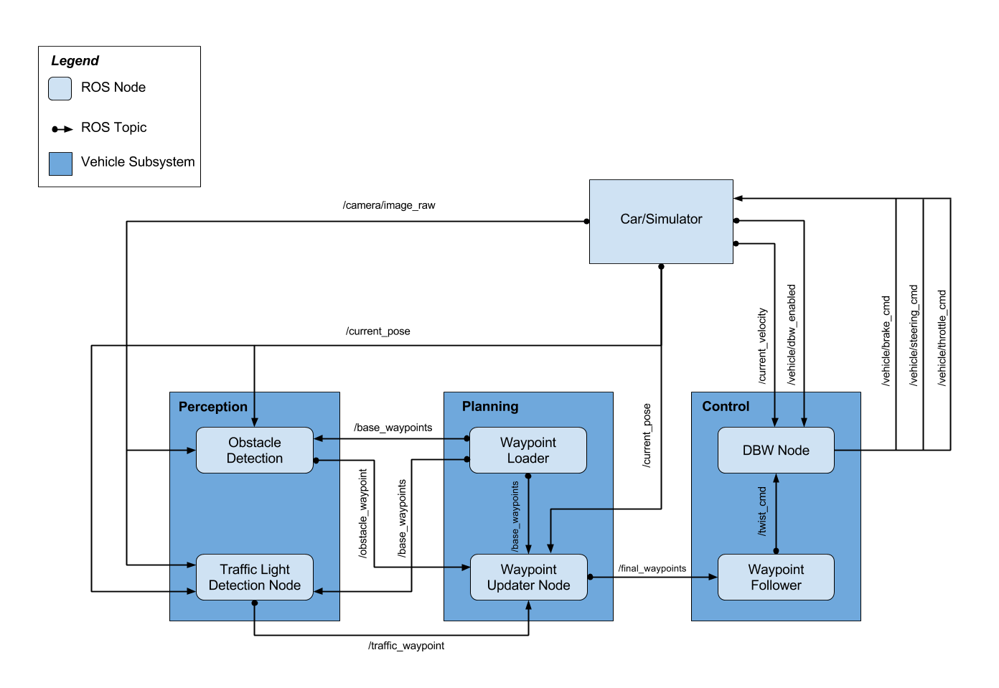
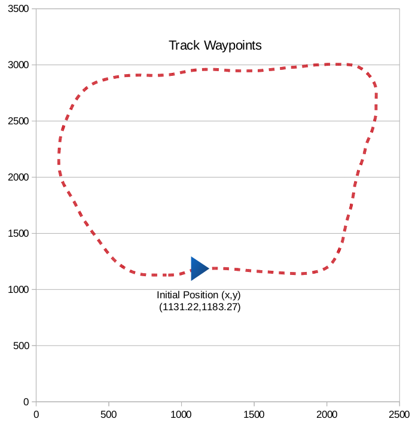
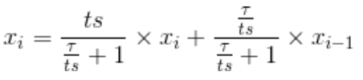
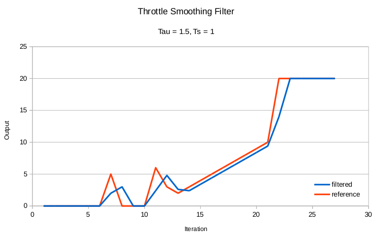

# System Integration

This is the project repo for the final project of the Udacity Self-Driving Car Nanodegree: Programming a Real Self-Driving Car. For more information about the project, see the project introduction [here](https://classroom.udacity.com/nanodegrees/nd013/parts/6047fe34-d93c-4f50-8336-b70ef10cb4b2/modules/e1a23b06-329a-4684-a717-ad476f0d8dff/lessons/462c933d-9f24-42d3-8bdc-a08a5fc866e4/concepts/5ab4b122-83e6-436d-850f-9f4d26627fd9).

## Team
Name | E-mail
:--- | ---:
Nino Pereira | ninopereira.pt@gmail.com
Mojtaba Valipour | vpcom@yahoo.com
David del Río Medina | ddrm86@gmail.com
Albert Killer | ackiller@gmail.com
Marcus Ulmefors | marcus@ulmefors.com

## Summary
The system integration project delivers an integrated solution of the most relevant components of a self-driving car. The Robot Operating System (ROS) was used as the backbone infrastructure that supports data communication between the different parts of the systems in a distributed and asynchronous way. 

The main components of the system include obstacle avoidance algorithms, traffic light detection and classification, trajectory generation (waypoint updater), trajectory tracker (pure pursuit algorithm) and a set of controllers for throttle, braking and steering.

All of the above except for the obstacle avoidance component, were implemented, tuned and integrated in a complete system that is able to move the car along a pre-defined set of waypoints (path) along a track in a smooth (reduced jitter) and controlled way while complying with the physical (car) constraints e.g. velocity, acceleration and braking power. 

## Objective
Given a set of waypoints and physical constraints, integrate the components of the system and implement the required functionality to drive the car along the track stopping at red lights and maintaining a  reference speed when possible.

## Archictecture overview


The diagram above illustrates all the main components of the system, their interfaces (inputs and outputs) and relationship.

The nodes (denomination for a block in ROS) are individual functional units that send and/or receive messages to and from other nodes in the system.

The load of the system is usually determined not only by the computational complexity of tasks inside each node but also the frequency at which they occur.

In a delicate control system such as an autonomous vehicle it is crucial to understand the limitations, bottlenecks and relative importance of each component of the system.

We could easily argue that in the present system the update frequency of the control block (which includes the Waypoint Follower and DBW nodes) has to be greater than the update frequency of the planning block (which includes the Waypoint Loader and Waypoint Updater Node).

## Components

### Car/Simulator
This node can either be the actual real car or a simulator.
In the case of the car, this node represents the agent that contains the all the sensors to acquire information from the environment (e.g. image, pose) and from the car itself (current velocity, manual/auto control button) and all the actuators necessary to control the vehicle (throttle, steering and braking systems).
In the case of the simulator besides providing a modelled system of the vehicle it also simulates an environment which interacts with the simulated vehicle. 

### Obstacle detection
This node requires as inputs:
- current pose
- camera image
- base waypoints

and outputs:
- obstacle waypoints

Its main function is to generate a set of waypoints in 2D that represents the obstacles location.

### Traffic light detector
This node requires as inputs:
- current pose
- camera image
- base waypoints

and outputs:
- red traffic light waypoint index

It detects the state of a traffic light in the current camera image (if any) and publishes the index of the waypoint (in the base waypoints list) of the next red traffic light.

### Waypoint loader
Inputs:
- file

Output:
- list of base waypoints

This node is used only once at the start of the run to load the base waypoints from a file and publish them to any node that requires it.

### Waypoint updater
Inputs:
- list of base waypoints
- current pose
- obstacle waypoint
- traffic waypoint

Output:
- final waypoints

This node uses the current pose of the vehicle to determine the next reference waypoint from the base waypoints list and the publishes a subset of waypoints (final waypoints) from that reference waypoint onwards (e.g. up to 200 waypoints). It also changes the reference speeds of any of those waypoints in this subset according to the presence of a red traffic light ahead. As an example, if there is a red traffic light 30 waypoints from the current pose then the subset of waypoints will have zero velocity from index 30 onwards.

### Waypoint follower
The waypoint follower has the following inputs:
- current pose
- current velocity
- final waypoints

and output:
- reference linear and angular velocities (twist command)

It implements a trajectory tracking algorithm (pure pursuit) that generates reference linear and angular velocities in order to make the car follow the desired trajectory.

### Drive-by-wire (dbw)
Inputs:
- current velocity
- auto/manual mode state (dbw_enabled)
- reference linear and angular speeds (twist_cmd)

Outputs:
- throttle command
- steering command
- brake command

The Drive-by-Wire (DBW) node implements controllers for the throttle, steering and brake commands.

## Implementation highlights
As a general performance improvement the queue size of every message being received was set to one. Note that each node publishes one or more messages at a given update frequency. The update frequency of each node was modified to maximise performance by saving resources without compromising the main functionality. Using the simulator as a test tool the update rates were set as follows for each of the components:


Component | Details
:--- | :---
Car/Simulator | Not available, not changed
Obstacle Detection | Not available, not changed
Traffic light detection | Same as input camera images
Waypoint Loader | Just once at the beginning
Waypoint Updater | 2 Hz
Waypoint Follower | 5 Hz
DBW Node | 15 Hz

With these settings it is possible to run the car along the track in a smooth and continuous mode with limited hardware resources. This works quite well for low speeds but as expected the low update frequencies somehow limit the maximum reference speed the car can be driven.

### Car/Simulator
Our initial strategy was to have a system that could use the simulator or the real car seamlessly. With that respect the controllers have the same settings and only the configuration values (constraints) change slightly according to whereas we are using the simulator or the car.

### Obstacle detection
Implemented for the real vehicle only by Carla team at Udacity.

### Traffic light detector

The light detector module first checks if the linear distance between the next stop line, whose coordinates are known, and the car is less than seventy meters. Although traffic lights are visible and can be classified from farther , the chosen distance threshold is big enough for the car to stop in time.

Traffic lights are classified in two classes: `red` and `not red`, where the latter includes green, yellow and unknown state. Pictures where there is no traffic light are classified as `not red`.

Two main approaches were followed in order to detect red traffic lights: localization and classification and whole picture classification.

##### Localization and classification

A detector capable of locating traffic lights within an image is implemented. The detector outputs a bounding box enclosing the traffic light. Then, the region of the picture where the traffic light is located can be extracted and fed to a classifier.

Two approaches were studied for the localization part:

1. Tensorflow's object detection API. It works very well even with the out-of-the-box models, which detect traffic lights among other objects, but processing times are too slow for real time detection. A custom trained model can solve performance problems, but there is the risk that the Tensorflow version installed in Carla is not compatible with the object detection API.

2. When the project got released for CarND the first time, Udacity suggested a _Computer Vision_ approach to identify traffic lights within the images captured by the car’s camera. Assuming a _pinhole camera model_ (as pictured below, source: [docs.opencv.org](http://docs.opencv.org/2.4/modules/calib3d/doc/camera_calibration_and_3d_reconstruction.html)) the goal is to project the position of a 3D-world object onto the 2D-image captured by the car’s camera.


To do so we get the position of the upcoming traffic light, which is given by the simulator or has to be defined for the test track on site. Together with the car’s position and orientation (_yaw_) we first calculate the [rotation-translation matrix](http://planning.cs.uiuc.edu/node99.html), which describes the camera motion around the static traffic light (with px being traffic light’s x-position; yaw and xt being the car’s rotation and translation):

```
px * cosyaw - py * sinyaw + xt,
px * sinyaw + py * cosyaw + yt,
pz + zt
```
Assuming a pinhole camera model without distortion we then apply a [perspective transformation](http://docs.opencv.org/2.4/modules/calib3d/doc/camera_calibration_and_3d_reconstruction.html) derived from following equations:


Due to some issues with applying the provided focal lengths to the simulator (Unity engine), equations and values had to be tweaked manually, which was elaborated during a [discussion on the Udacity CarND forum](https://discussions.udacity.com/t/focal-length-wrong/358568/25).

To cut out the whole traffic light we finally define a bounding box based on the real size of a traffic light, the Euclidean distance between both objects and the focal length (derived from [google’s paper on Traffic Light Mapping and Detection from 2011](https://static.googleusercontent.com/media/research.google.com/en//pubs/archive/37259.pdf))


Once a detector is implemented, cropped pictures of traffic lights from both the simulator and the test site can be used to train a classifier. If the accuracy of the bounding boxes is good, the classifier can be pretty simple and fast. In fact, very simple models such a _Support Vector Machine_ (SVM) or a small _Convolutional Neural Network_ (CNN) were implemented, both showing accurate results.

Unfortunately, due to the problems described above, we switched to a whole picture approach, which needs a considerably more complex classifier, but eliminates the need of an object detector. For further experiments the _Support Vector Classifier_ (SVC) can be setup by renaming `tl_classifier_SVC.py` to `tl_classifier.py` and then activating `project_to_image_plane` function by setting _True_ the `extract_traffic_light` variable within `tl_detection.py` . 

##### Whole picture classification

Contrary to the approaches discussed above the final version of the presented classifier does not require any transformation and localization of the actual traffic lights within the camera image. An involved _Convolutional Neural Network_ (CNN) was created and trained on camera images from the simulator as well as camera data provided by Udacity from the actual test site. The networks architecture was then improved and parameters were tuned extensively in order to achieve a degree of generalization that enables our classifier to predict red lights with equal accuracy, wether they were captured on site or within the simulator. 


### Waypoint loader
The update frequency was removed and this node only publishes one message at the start to reduce the overhead to a minimum. The list of base waypoints forms an enclosed path along a track.



### Waypoint updater

As the list of base waypoints forms a closed loop it was decided to implement a waypoint updater node that continuously moves the car along that list of waypoints and wraps around when it reaches the end. Usually when a path is given the first waypoint corresponds to the starting location and the final waypoint to the destination. In this case we assumed that it could not be the case and the car could start anywhere along the list of base waypoints. Also we decided not to stop the car at the end of the list but instead keep moving it around as this would facilitate intensive testing. The only assumption was that the order of the base waypoints matters and the car should follow the waypoints in the direction determined by the sequence of waypoints.

To get the next waypoint we search the entire list at the start and then to reduce computational effort we just search within a given range of waypoints:

```python
if self.previous_wp_index == -1:
    search_start = 0
    search_end = num_waypoints
else:
    search_start = self.previous_wp_index - 5   # Waypoints behind 
    search_end = self.previous_wp_index + 50    # Waypoints ahead
```
The distance from the current pose to the closest waypoint was monitored so that when the car moves to a location too far away (2 meters at the moment) from the closest waypoint the search defaults to the entire list again.

Proper care was given to handle to wrap the waypoints around when passing from the final waypoint to the starting waypoints. 

Some safety critical failures were also taken into account: the car stops safely if the expected and necessary messages are not received within a reasonable time frame. For that a watchdog mechanism was put in place so that if any of the messages is delayed, the car sets the reference linear and angular speeds to zero which then will bring the car to a stop.

```python
if (self.current_timestamp - self.pose_timestamp).nsecs > self.watchdog_limit:
    # stop the car
    rospy.logwarn("Safety hazard: not receiving POSE info for long time. Stopping the vehicle!")
    emergency_stop = True
if (self.current_timestamp - self.tf_timestamp).nsecs > self.watchdog_limit:
    # stop the car
    rospy.logwarn("Safety hazard: not receiving TRAFFIC_LIGHT info for long time. Stopping the vehicle!")
    emergency_stop = True
if emergency_stop:
    list_wp_to_pub = copy.deepcopy(self.waypoints[0:LOOKAHEAD_WPS])
    # force linear and angular speed to be zero
    for i in range(len(list_wp_to_pub)):
        list_wp_to_pub[i].twist.twist.linear.x = 0
        list_wp_to_pub[i].twist.twist.angular.z = 0
```

The Waypoint updater also handles the traffic light state by setting the reference speed to zero for all the waypoints beyond the traffic sign location. It also gradually decreases the speed a few waypoints before the traffic light.

```python
if self.tf_index != -1:
   # set speed to zero a few waypoints before the traffic_lights
            for i in range(index_in_wp_list-MARGIN,LOOKAHEAD_WPS): 
                list_wp_to_pub[i].twist.twist.linear.x = 0.0
            # for wp before the target tf_index decrease speed gradually until the tf_index
            ref_speed = 0.0
            for i in range(index_in_wp_list-MARGIN-1, -1, -1):
                if list_wp_to_pub[i].twist.twist.linear.x > ref_speed:
                    list_wp_to_pub[i].twist.twist.linear.x = ref_speed
                    ref_speed = ref_speed + 0.2
```

### Waypoint follower

This node implements a pure pursuit algorithm. The update frequency was changed to 15Hz in order to save resources and improve performance of the overall system.

### Drive-by-wire

The Drive by Wire node is part of the control layer which interfaces directly with the agent (car/simulator) by sending control commands, namely steering, throttle and braking comands.

The steering control was implemented independently of the throttle and braking control.

The steering is limited by a maximum steering angle which is a constraint of the system. Given the desired linear and angular velocities together with the current linear velocity the get_steering function outputs the steering command to be applied directly to the system.

```python
steer = self.yaw_control.get_steering(self.des_linear_velocity, self.des_angular_velocity, self.cur_linear_velocity)
```

The throttle command is controlled by a PID controller. The PID parameters were manually tuned (Kp=0.8, Ki=0.25, Kd=0.1).
```python
# Set once at the beginning
self.throttle_control = Controller(pid_kp=0.8, pid_ki=0.25, pid_kd=0.1,
                                   min_value=self.decel_limit, max_value=self.accel_limit)

# pid for acceleration
throttle, brake, steering = self.throttle_control.control(self.des_linear_velocity,
                                                          self.cur_linear_velocity,
                                                          self.dbw_enabled)
```
A low pass filter was implemented to smooth throttle commands according to the following the equation:




This filter as any filter of this nature produces a smoother transition but also some delay in response time as shown in the picture below.




Since breaking corresponds to a deceleration which in turn is just a negative throttle, we take the ouput of the PID controlled and use it to calculate the braking command when the throttle value is negative.

Brake commands are published as torque values and calculated as:
brake = vehicle_mass * deceleration * wheel_radius
```python
if throttle < -self.brake_deadband:
    brake = self.vehicle_mass * abs(throttle) * self.wheel_radius
```

The auto/manual mode is toggled by the operator and the DBW node receives its status through a variable dbw_enabled. In order to prevent obsolete proportional, differential and specially PID integral errors to influence the behaviour the PID error values are reset every time the manual mode gets active. This way once auto mode is enabled again the PID controller starts fresh and responsive.

The reset function is called inside control function in twist_controller file.
```python
if dbw_enabled:
    ...
else:
    self.reset()
```

Safety critical failures were handled with a watchdog mechanism in the same way as before by stopping the car safely if the expected messages are not received within a reasonable time frame. In this case failure to receive updated current velocity, current pose or the final waypoints before the watchdog periodic check leads to the decision of making the car stop as soon as possible. This is achieved indirectly by setting the desired linear speed to zero in order to let the controller bring the car to a smooth stop. 

```python
if (self.current_timestamp - self.vel_timestamp).nsecs > self.watchdog_limit:
    # Stop the car
    rospy.logwarn("Safety hazard: not receiving VEL info for long time. Stopping the vehicle!")
    self.des_linear_velocity = 0

if  (self.current_timestamp - self.twist_cmd_timestamp).nsecs > self.watchdog_limit:
    # Stop the car
    rospy.logwarn("Safety hazard: not receiving TWIST_CMD info for long time. Stopping the vehicle!")
    self.des_linear_velocity = 0
```


## Conclusions


## Further work
There are several parts of the system that can be improved or better tuned.
Here is a list of potential improvements and other things to try:

* Improve tunning of PID parameters either by manual experimentation or using auto-tunig algorithms such as the Twiddle algorithm;
* Replace the pure pursuit algorithm with a MPC (Model predictive control algorithm) which is generally agreed as being one of the best control algorithms for this purpose;
* Improve or remove the low pass filter if other parts of the system already provide the required smoothness;
* Implement a low pass filter for the steering command if real tests show too much lateral accelerations

## Instructions

### Run
```bash
catkin_make & source devel/setup.bash & roslaunch launch/styx.launch
```
Then launch the simulator

#### Fixing issues with dbw_mkz_msgs
```bash
bash <(wget -q -O - https://bitbucket.org/DataspeedInc/dbw_mkz_ros/raw/default/dbw_mkz/scripts/sdk_install.bash)
```
See original instructions here: https://bitbucket.org/DataspeedInc/dbw_mkz_ros/src/996cd2152159058269f292f40fcddb404e3107b4/ROS_SETUP.md?fileviewer=file-view-default

### Installation 

* Be sure that your workstation is running Ubuntu 16.04 Xenial Xerus or Ubuntu 14.04 Trusty Tahir. [Ubuntu downloads can be found here](https://www.ubuntu.com/download/desktop).
* If using a Virtual Machine to install Ubuntu, use the following configuration as minimum:
  * 2 CPU
  * 2 GB system memory
  * 25 GB of free hard drive space

  The Udacity provided virtual machine has ROS and Dataspeed DBW already installed, so you can skip the next two steps if you are using this.

* Follow these instructions to install ROS
  * [ROS Kinetic](http://wiki.ros.org/kinetic/Installation/Ubuntu) if you have Ubuntu 16.04.
  * [ROS Indigo](http://wiki.ros.org/indigo/Installation/Ubuntu) if you have Ubuntu 14.04.
* [Dataspeed DBW](https://bitbucket.org/DataspeedInc/dbw_mkz_ros)
  * Use this option to install the SDK on a workstation that already has ROS installed: [One Line SDK Install (binary)](https://bitbucket.org/DataspeedInc/dbw_mkz_ros/src/81e63fcc335d7b64139d7482017d6a97b405e250/ROS_SETUP.md?fileviewer=file-view-default)
* Download the [Udacity Simulator](https://github.com/udacity/CarND-Capstone/releases/tag/v1.2).

### Docker Installation
[Install Docker](https://docs.docker.com/engine/installation/)

Build the docker container
```bash
docker build . -t capstone
```

Run the docker file
```bash
docker run -p 127.0.0.1:4567:4567 -v $PWD:/capstone -v /tmp/log:/root/.ros/ --rm -it capstone
```

### Usage

1. Clone the project repository
```bash
git clone https://github.com/udacity/CarND-Capstone.git
```

2. Install python dependencies
```bash
cd CarND-Capstone
pip install -r requirements.txt
```
3. Make and run styx
```bash
cd ros
catkin_make
source devel/setup.sh
roslaunch launch/styx.launch
```
4. Run the simulator

### Real world testing
1. Download [training bag](https://drive.google.com/file/d/0B2_h37bMVw3iYkdJTlRSUlJIamM/view?usp=sharing) that was recorded on the Udacity self-driving car (a bag demonstraing the correct predictions in autonomous mode can be found [here](https://drive.google.com/open?id=0B2_h37bMVw3iT0ZEdlF4N01QbHc))
2. Unzip the file
```bash
unzip traffic_light_bag_files.zip
```
3. Play the bag file
```bash
rosbag play -l traffic_light_bag_files/loop_with_traffic_light.bag
```
4. Launch your project in site mode
```bash
cd CarND-Capstone/ros
roslaunch launch/site.launch
```
5. Confirm that traffic light detection works on real life images
