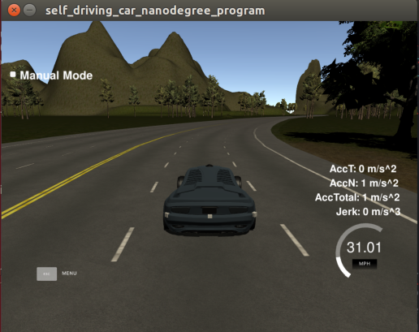

### Installation

* [ROS](http://wiki.ros.org/indigo/Installation/Ubuntu)
* [Dataspeed DBW](https://bitbucket.org/DataspeedInc/dbw_mkz_ros)

Download the [Udacity Simulator](https://github.com/udacity/self-driving-car-sim/releases/tag/v0.1).

### Usage

1. Install python dependencies
```bash
cd styx
pip install -r requirements.txt
```
2. Make and run styx
```bash
cd ros
catkin_make
source devel/setup.sh
roslaunch launch/styx.launch
```
3. Run the simulator


