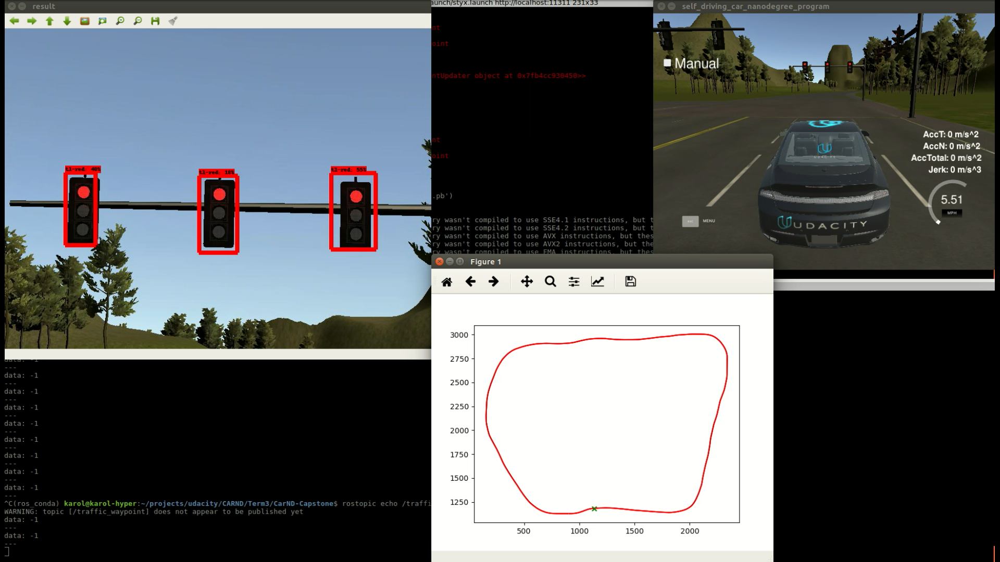

## Traffic lights detection

Team info: README.md

Author:
- Karol Majek karolmajek@gmail.com

Traffic lights detection implemented using Tensorflow object detection API. Trained using data from [udacity/self-driving-car Annotated Driving Dataset 2 (Autti)](https://github.com/udacity/self-driving-car/tree/master/annotations). I have used Mobilenet pretrained on COCO dataset. The model recognizes 3 classes: tl_red, tl_orange (yellow light...), tl_green. Implamentation can be found in standalone node tl_detector. It runs with docker!

---------

Click to see full video on YouTube:

Click to see full video on YouTube:

Click to see full video on YouTube:

On data from Warsaw, Poland: [Click to see full video on YouTube]

