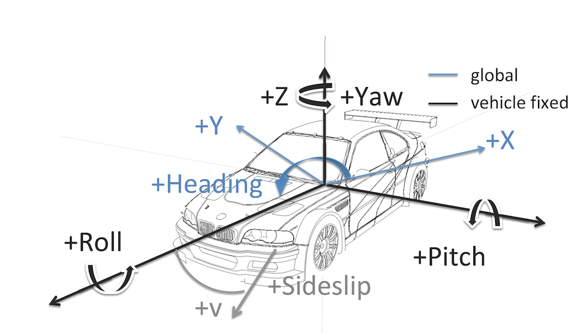

### waypoint_updater.py

This is a README file to explain the **waypoint_updater.py** file that I´m working on the **Running-Out-Of-Fuel Team for the USDC ND Capstone**.

This is the **first version** of the node to start running the simulator that only is going to be subscribed to the nodes:

* /base_waypoints
* /current_pose

And publish a list of waypoints to:

* /final_waypoints

**Take in account that for this first version we are not going to care about traffic lights and obstacles**.

The final purpose of this node in its final version is to publish a fixed number of waypoints ahead of the vehicle with the correct target velocities, depending of the traffic lights and obstacles.

#### LOOKAHEAD_WPS and MAX_SPEED 

The variable LOOKAHEAD_WPS gives us the total number of waypoints ahead of the vehicle that should be included in the /final_waypoints list. Here we start with 200 points.

The variable MAX_SPEED gives us the maximum speed objetive for the track in MPS (meters per second). We use the CONVERSION FACTOR to convert from MPH (miles per hour) to MPS.

#### WaypointUpdater Class

Here we define a class for this node called WaypointUpdater.

First, we initialize the waypoint_update node.

Then, we make the next subscriptions:

* Subscribe to the TOPIC /current_pose, with a type of message PoseStamped and a callback function pose_cb
* Subscribe to the TOPIC /base_waypoints, with a type of message Lane and a callback function waypoints_cb
* FILL!!!!!!!
* FILL!!!!!!

And we publish to the topic /final waypoints, with a type of message Lane and a parameter queue_size=1 (asyncronous publication).

Then, we add and define the member variables: current_pose (actual position), waypoints and frame_id

Finally, at the end a rospy.spin() method is used to block until a shutdown request is received by the node.

##### pose_cb() function

Here, we initialize the variable values for current_pose and frame_id and activate the publish() function.

##### waypoints_cb() function

In this functions, we set the waypoints variable.

##### traffic_cb() function

FILL!!!!!!!

##### obstacle_cb() function

FILL!!!!!!!

##### get_waypoint_velocity() function

Return as a result the x direction of linear velocity of a waypoint.

##### set_waypoint_velocity() function

Sets the x direction linear velocity of the waypoint position of a waypoints list (waypoints[waypoint]) to the velocity entered as parameter.

The coordinates used for linear velocity are vehicle-centered.

##### distance() function

Compute and returns the distance between two points positions (entered as parameters wp1 and wp2) in the waypoints list.

We access to the w,y and z position coordinates points with waypoints[i].pose.pose.position.

##### closest_waypoint() function

Compute the closest way point to our current position, using code from Path Planning Project.

##### next_waypoint() function

Compute the next waypoint to our current position, using the closest_waypoint function using the angle difference between yaw and heading.

For computing the yaw, we use a transformation using the quaternion orientations (x,y,z,w anhle orientations from quaternion).

For this function, we use code from Path Planning Project.

##### publish() function

Here, we obtain the list of waypoints ahead to publish (a subset of total waypoints; number of points equal to LOOKAHEAD_WPS) and assign them a maximum speed with a value of MAX_SPEED.

Then we initialize a Lane object (lane) and assign it the values of frame_id, time and the list of waypoints ahead.

Finally, we publish lane in the /final waypoints topic.

#### Final lines of code

If the name variable is set to "main", indicating that this script is being executed directly, the WaypointUpdater() function will be called.

There is here a particular exception that is raised when the node has been signaled for shutdown and a log error is sent to Python's stdout showing the message: "Could not start waypoint updater node".
