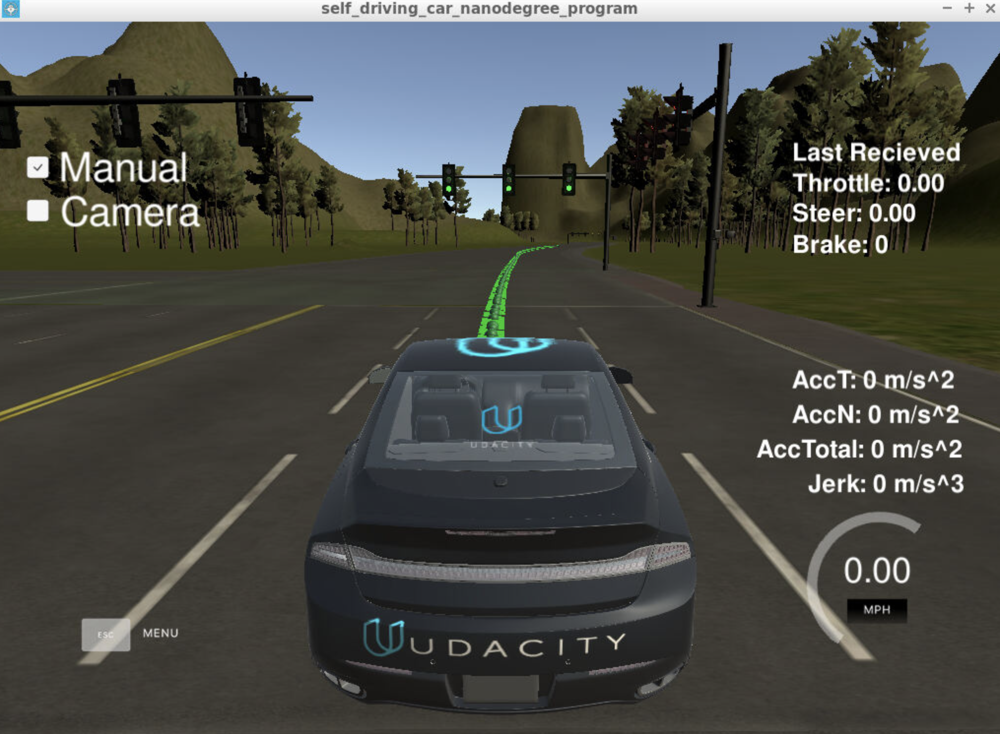

# progress
Finished waypoint_updater.py, validate by seeing green dots representing waypoints:



# simulator has two test tracks:

A highway test track with traffic lights
  the first track has a toggle button for camera data. Many students have experienced latency when running the simulator together with a virtual machine, and leaving the camera data off as you develop the car's controllers will help with this issue.
A testing lot test track similar to where we will run Carla
  To use the second test lot, you will need to update your code to specify a new set of waypoints. We'll discuss how to do this in a later lesson.

# units
the simulator displays vehicle velocity in units of mph. However, all values used within the project code are use the metric system (m or m/s), including current velocity data coming from the simulator.

# team size
Note that we'd like a minimum team size of 4
# components
## traffic light detection
* package source: ros/src/tl_detector/
* /current_pose topic : provides the vehicle's current position
* /base_waypoints topic: provides a complete list of waypoints the car will be following.
* tl_classfier.py: tl_detector/light_classification_model/tl_classfier.py
*  tl_detector.py : tl_detector/tl_detector.py

|   node     | subscribed to | publish to |
| :-----------: |:-------------:| :-----:|
| tl_detector.py (3) | /image_color (3) | /traffic_waypoint |
| | /current_pose | |
| | /base_waypoints | |
| tl_classfier.py | |  |
| waypoint_updater.py (4)| /current_pose (1) | /final_waypoints (1) |
| | /base_waypoints (1) | |
| | /obstacle_waypoint | |
| | /traffic_waypoint | |
| dbw_node.py (2) | /current_velocity | /vehicle/throttle_cmd |
| | /twist_cmd | /vehicle/brake_cmd |
| | /vehicle/dbw_enabled | /vehicle/steering_cmd |
| twist_controller.py | |  |

|   top     | message type  | description|
| :-----------: |:-------------:| :-------------:|
|   /base_waypoints	| styx_msgs/Lane | Waypoints as provided by a static .csv file. |
| /current_pose	| geometry_msgs/PoseStamped | Current position of the vehicle, provided by the simulator or localization. |
| /final_waypoints |	styx_msgs/Lane | This is a subset of /base_waypoints. The first waypoint is the one in /base_waypoints which is closest to the car. |

## waypoint updater
* package source: ros/src/waypoint_updater/
* purpose: to update the target velocity property of each waypoint based on traffic light and obstacle detection data
## twist_controller

# Suggested Order of Project Development

1. Waypoint Updater Node (Partial): Complete a partial waypoint updater which subscribes to /base_waypoints and /current_pose and publishes to /final_waypoints.
2. DBW Node: Once your waypoint updater is publishing /final_waypoints, the waypoint_follower node will start publishing messages to the/twist_cmd topic. At this point, you have everything needed to build the dbw_node. After completing this step, the car should drive in the simulator, ignoring the traffic lights.
3. Traffic Light Detection: This can be split into 2 parts:
    * Detection: Detect the traffic light and its color from the /image_color. The topic /vehicle/traffic_lights contains the exact location and status of all traffic lights in simulator, so you can test your output.
    * Waypoint publishing: Once you have correctly identified the traffic light and determined its position, you can convert it to a waypoint index and publish it.
4. Waypoint Updater (Full): Use /traffic_waypoint to change the waypoint target velocities before publishing to /final_waypoints. Your car should now stop at red traffic lights and move when they are green.


# learning ROS
- message header: http://wiki.ros.org/Messages
```
# Standard metadata for higher-level stamped data types.
# This is generally used to communicate timestamped data
# in a particular coordinate frame.
#
# sequence ID: consecutively increasing ID
uint32 seq
#Two-integer timestamp that is expressed as:
# * stamp.sec: seconds (stamp_secs) since epoch (in Python the variable is called 'secs')
# * stamp.nsec: nanoseconds since stamp_secs (in Python the variable is called 'nsecs')
# time-handling sugar is provided by the client library
time stamp
#Frame this data is associated with
# 0: no frame
# 1: global frame
string frame_id
```

# common commands
```
rostopic list
rostopic info /final_waypoints
rosmsg info styx_msgs/Lane
```
# msg
x direction linear velocity of the first waypoint:
```
my_lane_msg[0].twist.twist.linear.x
```


# errors encountered
No module named terminal_color
```
pip install --upgrade catkin_pkg
```

ERROR: Unable to communicate with master!
```
cd ros
catkin_make
source devel/setup.sh
roslaunch launch/styx.launch
```
